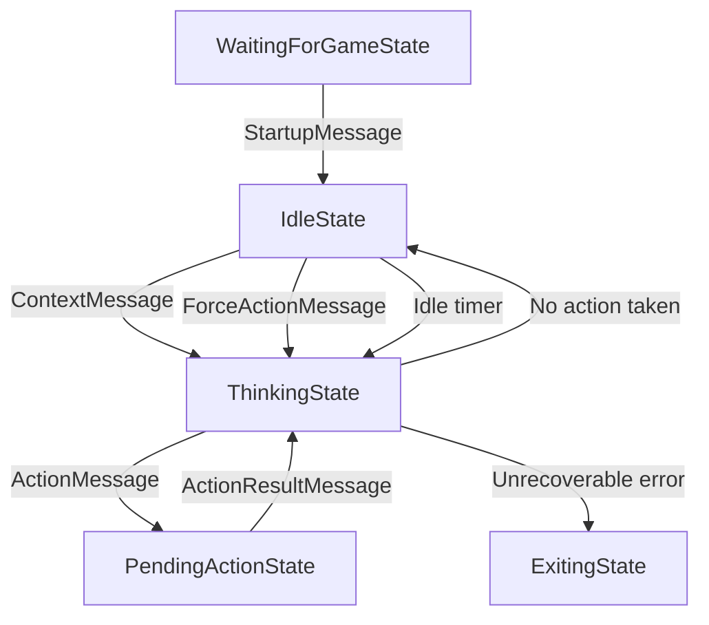

## API Messages

```ts
export type Message =
    | StartupMessage
    | ContextMessage
    | RegisterActionsMessage
    | UnregisterActionsMessage
    | ForceActionMessage
    | ActionResultMessage
    | ActionMessage;
```

See `api-types.ts` for details on each message type.

## States



### `BaseState`

```ts
interface BaseState {
    id: string;
    since: Date;
    game: string;
}
```

The base type for all states.
Contains the `since: Date` field, representing the time the state was entered,
and the `game: string` field, the name of the game being played.

### `WaitingForGameState`

```ts
export interface WaitingForGameState extends BaseState {
    id: "state/waiting-for-game-startup";
    game: never;
}
```

The initial state when Jippity starts up, waiting for a `StartupMessage`.
This is the only state for which the `game` field is `never`.

When a `StartupMessage` is received, the state transitions to `IdleState`.

### `IdleState`

```ts
export interface IdleState extends BaseState {
    id: "state/idle";
}
```

The idle state represents downtime where the agent isn't thinking or waiting for an action result.

When a `ContextMessage` is received with `data.silent == false`, the state transitions to `ThinkingState`.
When a `ForceActionMessage` is received, the state transitions to `ThinkingState`.
When an internal timer triggers the agent to think, the state transitions to `ThinkingState`.

### `ThinkingState`

```ts
import {ActionResultMessage} from "./api-types";

export interface ThinkingState extends BaseState {
    id: "state/thinking";
    trigger: ContextMessage | ForceActionMessage | ActionResultMessage | null;
}
```

The thinking state represents the period where the LLM is generating a response.
The `trigger` field indicates what caused the agent to start thinking:

- `ContextMessage`: The agent is reacting to new context from the game.
- `ForceActionMessage`: The agent received a `ForceActionMessage`, instructing it to take an action immediately.
- `ActionResultMessage`: The agent received an `ActionResultMessage`, indicating the result of its previous action.
- `null`: The agent is thinking without a specific trigger, possibly due to an internal timer.

When the agent finishes thinking, the state transitions to...

- `PendingActionState` with an `ActionMessage`, if the agent decided to take an action.
- `IdleState`, if the agent decided not to take any action.

### `PendingActionState`

```ts
export interface PendingActionState extends BaseState {
    id: "state/pending-action";
    action: ActionMessage;
    forceAction?: ForceActionMessage
}
````